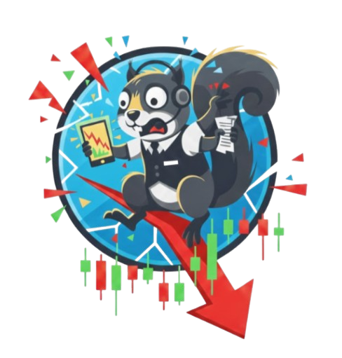

# Panic Trade

<div align="center">
  
  
  **A Java-based stock trading simulation application**
</div>

---

## Table of Contents

- [About](#about)
- [Features](#features)
- [Architecture](#architecture)
- [Getting Started](#getting-started)
- [User Stories](#user-stories)
- [API Information](#api-information)
- [Project Structure](#project-structure)
- [Technologies Used](#technologies-used)

---

## About

**Panic Trade** is a stock trading simulation application built with the help of Java Swing. Users can create an account, search for stocks, manage portfolios, track watchlists, view market news, and compete on our very own leaderboard based on portfolio performance. We built it to follow Clean Architecture principles, ensuring separation of concerns and maintainability.

---

## Features

### Core Functionality

- **User Authentication**
  - User signup and login
  - Secure password management
  - Session management

- **Stock Trading**
  - Search for stocks by symbol or company name
  - View real-time stock prices
  - Buy and sell stocks
  - View transaction receipts

- **Portfolio Management**
  - View current portfolio holdings
  - Track portfolio value
  - Monitor performance

- **Watchlist**
  - Add stocks to watchlist
  - Remove stocks from watchlist
  - Track favorite stocks

- **Market News**
  - View latest financial news
  - Stay updated with market trends

- **Leaderboard**
  - Rank users by portfolio value
  - View top traders
  - Check user purchase history
  - Competitive trading environment

---

## Architecture

This project follows **Clean Architecture** principles with clear separation of layers:

```
src/main/java/
├── app/                    # Application entry point and builder
├── view/                   # UI components (Swing)
├── interface_adapter/      # Presenters, ViewModels, Controllers
├── use_case/              # Business logic (Interactors)
├── data_access/           # Data access layer (API calls)
└── entity/                # Domain entities
```

### Key Components

- **Views**: Java Swing UI components (`LoginView`, `PortfolioView`, `LeaderboardView`, etc.)
- **Interface Adapters**: Controllers, Presenters, and ViewModels that bridge UI and business logic
- **Use Cases**: Business logic interactors that handle specific features
- **Data Access**: Objects that interact with the REST API backend
- **Entities**: Domain models representing core business objects

---

## Getting Started

### Prerequisites

- Java JDK 11 or higher
- Maven (for dependency management)
- Access to the application server (for API calls)

### Running the Application

1. **Clone the repository**
   ```bash
   git clone <repository-url>
   cd team-project-csc207g21
   ```

2. **Ensure the backend server is running**
   - The application connects to a REST API server
   - Default server URL: `http://localhost:4848/rest`

3. **Compile and run**
   ```bash
   # Navigate to project root
   cd team-project-csc207g21
   
   # Compile (if using Maven)
   mvn compile
   
   # Run the application
   mvn exec:java -Dexec.mainClass="app.Main"
   ```
   
   Or run directly from your IDE by running `app.Main`.

### Setup

1. Launch the application
2. Click "Create Account" to sign up
3. Enter a username and password (minimum 5 characters)
4. Log in with your credentials
5. Start exploring stocks and build your portfolio!

---

## User Stories

This section outlines all of our user stories.

### Authentication
- **Sign Up**: Users can create a new account with a username and password
- **Log In**: Existing users can log in to access their account
- **Log Out**: Users can securely log out of their session

### Stock Trading
- **Search Stocks**: Users can search for stocks by symbol or company name
- **View Stock Prices**: Users can view current stock prices and details
- **Buy Stocks**: Users can purchase stocks at market price
- **Sell Stocks**: Users can sell owned stocks at market price

### Portfolio Management
- **View Portfolio**: Users can view their current holdings and portfolio value
- **Track Performance**: Users can monitor their portfolio's performance over time

### Watchlist
- **Add to Watchlist**: Users can add stocks to their watchlist for easy tracking
- **Remove from Watchlist**: Users can remove stocks from their watchlist
- **View Watchlist**: Users can see all stocks in their watchlist

### News
- **View Market News**: Users can read the latest financial news and market updates

### Leaderboard
- **View Rankings**: Users can see a leaderboard ranked by portfolio value
- **View User Details**: Users can click on leaderboard entries to view purchase history
- **Competition**: Users can compete with others to reach the top of the leaderboard

---

## API Information

The application communicates with a REST API backend server. Below are the main endpoints:

### Stock Information
```
GET /rest/stocks/stock/?symbols={SYMBOL}
```
Example: `http://100.67.8.245:4848/rest/stocks/stock/?symbols=AAPL`

### User Management
```
POST /rest/user/signup/?username={USERNAME}&password={PASSWORD}&password2={PASSWORD}
```
Example: `http://100.67.8.245:4848/rest/user/signup/?username=Hello2&password=world&password2=world`

### Trading
```
POST /rest/buy/marketorder/?symbol={SYMBOL}&amount={AMOUNT}&username={USERNAME}&password={PASSWORD}
POST /rest/sell/marketorder/?symbol={SYMBOL}&amount={AMOUNT}&username={USERNAME}&password={PASSWORD}
```
Example: `http://100.67.8.245:4848/rest/buy/marketorder/?symbol=BRK.B&amount=3&username=Hello2&password=world`

### Leaderboard
```
GET /rest/leaderboard/get
```
Returns leaderboard data with user rankings and portfolio values.

---

## Project Structure

```
team-project-csc207g21/
├── src/
│   ├── main/
│   │   ├── java/
│   │   │   ├── app/              # Application entry point
│   │   │   ├── view/             # UI components
│   │   │   ├── interface_adapter/ # Controllers, Presenters, ViewModels
│   │   │   ├── use_case/         # Business logic
│   │   │   ├── data_access/      # API access layer
│   │   │   └── entity/           # Domain models
│   │   └── resources/
│   └── test/
│       └── java/                  # Unit tests
├── src/image/
│   └── panictraderpic.png        # Application logo
├── ApplicationServerLiberty/     # Backend server code
├── pom.xml                        # Maven configuration
└── README.md                      # This file
```

---

## Technologies Used

- **Java**: Core language
- **Java Swing**: GUI framework
- **Maven**: Dependency management and build tool
- **JUnit**: Unit testing framework
- **REST API**: Backend communication
- **SQLite**: Database (via backend server)

---

## Previews

### Login Screen


### Portfolio View


### Leaderboard


### Watchlist


### Stock Search


### News


---

## Team

Jerry: worked on News Feed feature
Marko: worked on the Search Function feature
Pranav: worked on the Leaderboard feature
Lucas: worked on the Buy/Sell feature
Aeriz: worked on the Watchlist feature
Alex: worked on the Portfolio feature

---

## Notes

- The application requires an active connection to the backend server
- Stock prices and data are fetched in real-time from the API
- Portfolio values are calculated based on current market prices
- The leaderboard updates periodically to reflect current rankings

---

## Keeping This README Updated

Please keep this README up-to-date with information about your project throughout the term. By maintaining this documentation, your team will find it easier to prepare for the final presentation at the end of the term.

---

<div align="center">
  <p>Built by Team CSC207G21</p>
  <p>© 2025 Panic Trade</p>
</div>
